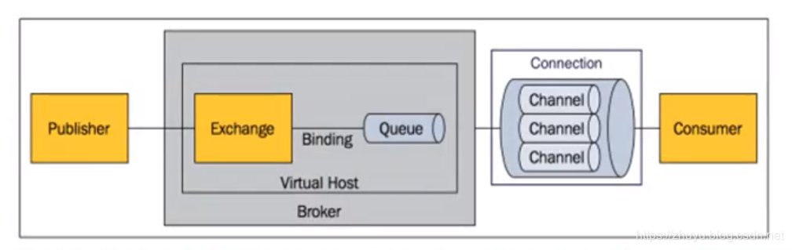

- https://blog.csdn.net/zhuyu19911016520/category_7401304.html

# HikariCP数据库连接池

性能测试报告: https://blog.csdn.net/u011389515/article/details/76578129

- 性能方面 hikariCP>druid>tomcat-jdbc>dbcp>c3p0 。hikariCP的高性能得益于最大限度的避免锁竞争。
- Druid功能最为全面，sql拦截等功能，统计数据较为全面，具有良好的扩展性。
- 综合性能，扩展性等方面，可考虑使用druid或者hikariCP连接池。
- 可开启prepareStatement缓存，对性能会有大概20%的提升。

# Redis的几种模式
 
1. 持久化：持久化是最简单的高可用方法(有时甚至不被归为高可用的手段)，主要作用是数据备份，即将数据存储在硬盘，保证数据不会因进程退出而丢失。
2. 复制：主从复制是高可用Redis的基础，哨兵和集群都是在复制基础上实现高可用的。复制主要实现了数据的多机备份，以及对于读操作的负载均衡和简单的故障恢复。缺陷：故障恢复无法自动化；写操作无法负载均衡；存储能力受到单机的限制。
3. 哨兵：在复制的基础上，哨兵实现了自动化的故障恢复。缺陷：写操作无法负载均衡；存储能力受到单机的限制。
4. 集群：通过集群，Redis解决了写操作无法负载均衡，以及存储能力受到单机限制的问题，实现了较为完善的高可用方案。

# Mongodb的使用

## 应用案例
- 京东,中国著名电商,使用MongoDB存储商品信息,支持比价和关注功能
- 赶集网,中国著名分类信息网站,使用MongoDB记录pv浏览计数
- 百度云,使用MongoDB管理百度云盘中500亿条关于文件源信息的记录

## 不适合场景

- 不支持事务，需要高度事物性的系统：例如银行或会计系统
- 需要SQL的系统

# RabbitMQ消息队列

## 为什么使用消息队列

- 系统解耦：在分布式环境中，可能有A、B、C、D…等多个系统，A直接调用B提供的服务接口，当A系统修改时，可能需要B也跟着修改，这样耦合性比较强。MQ可以解耦这样的场景
- 流量销峰：在电商抢购活动中，商品可能几秒钟就被抢购完，但是系统或数据库无法在几秒内处理所有请求，大量请求或许会让数据库直接崩溃，把请求压到队列中，消费者有序的处理队列中的请求
- 稳定性：队列有确认机制，当消费者进程异常时，也就是该消息还没有被确认消费，那么其他消费进程可再次处理该消息

## RabbitMQ 特点

- 可靠性：RabbitMQ 使用一些机制来保证可靠性，如持久化、传输确认、发布确认
- 消息集群：多个 RabbitMQ 服务器可以组成一个集群，形成一个逻辑 Broker
- 高可用：队列可以在集群中的机器上进行镜像，使得在部分节点出问题的情况下队列仍然可用。
- 多语言客户端：RabbitMQ 几乎支持所有常用语言，比如 Java、.NET、Ruby 等
- 管理界面：RabbitMQ 提供了一个易用的用户界面，使得用户可以监控和管理消息 Broker 的许多方面

## RabbitMQ有 4 个重要概念

分别为：虚拟主机，交换机，队列，和绑定。

- Broker：RabbitMQ队列服务器，里面可以有多个 虚拟主机 Virtual Host
- Virtual Host：为什么需要多个虚拟主机呢？很简单，RabbitMQ当中，用户只能在虚拟主机的粒度进行权限控制。 因此，如果需要禁止A组访问B组的交换机/队列/绑定，必须为A和B分别创建一个虚拟主机。每一个RabbitMQ服务器都有一个默认的虚拟主机“/”。
- Exchange：交换机用于转发消息，但是它不会做存储 ，如果没有 Queue bind 到 Exchange 的话，它会直接丢弃掉 Producer 发送过来的消息。 这里有一个比较重要的概念：路由键 。消息到交换机的时候，交互机会转发到对应的队列中，那么究竟转发到哪个队列，就要根据该路由键。
- Binding：交换机需要和绑定队列，这其中如上图所示，是多对多的关系。
- Queue：队列
- Connection：连接，建立一个tcp连接，使用多路复用方式提升性能，节约资源
- Channel：信道，一个连接可以多路复用打开多个信道，获取队列中的消息

## RabbitMQ常用的交换机Exchange Type有四种

direct、fanout、topic、headers

- direct:点对点模式,一对一关系，把消息投递到那些binding key与routing key完全匹配的队列中。
- fanout:广播模式,一对多关系，转发消息到所有绑定队列。
- topic:发布订阅模式,一对多关系，按规则转发消息,将消息路由到binding key与routing key模式匹配的队列中。
- headers:设置header attribute参数类型的交换机，很少用
