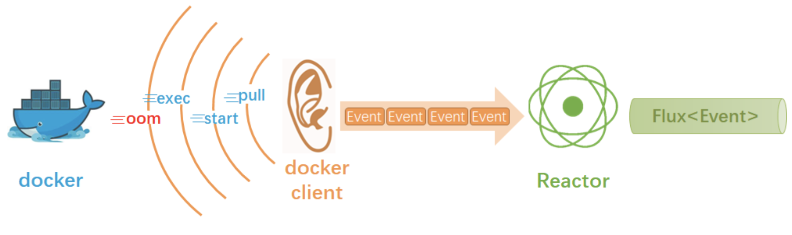

# Docker事件推送API

Docker提供了一个用来监听事件的命令：docker events，运行这个命令后，会监听docker daemon的事件并打印出来，执行是持续进行的，就像top或前边介绍的mongostat命令一样。Docker的java开发包的DockerClient也提供了相应的API，这个API是基于回调的，因此我们就可以使用Reactor的create方法，将这个基于回调的API转换为响应式流，流中的数据就是一个一个的docker事件

# Setup Maven wrapper

- https://github.com/takari/maven-wrapper

`mvn -N io.takari:maven:0.7.7:wrapper -Dmaven=3.5.4`
