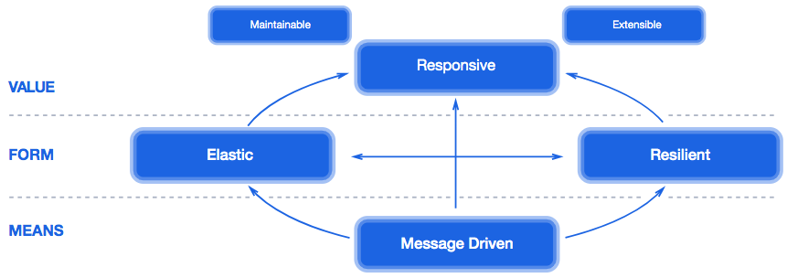
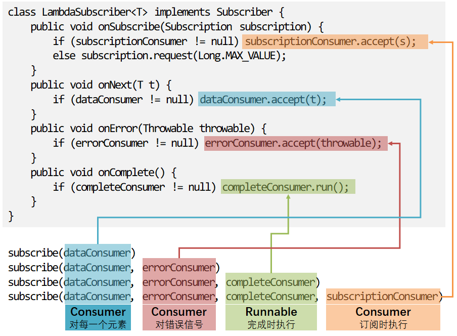
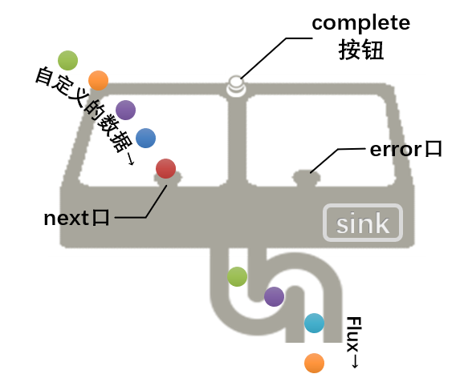
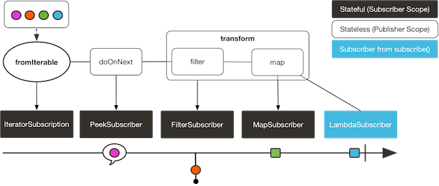
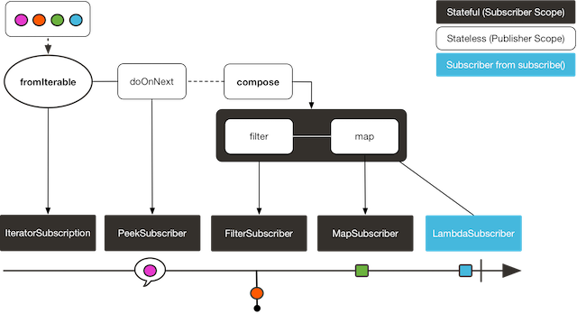

- https://blog.csdn.net/get_set/category_7484996.html / 2018
- https://github.com/get-set/get-reactive/ (2 projects relates to performance testing needs to follow up)

# Script step by step

```bash
./mvnw clean spring-boot:run
```

# One stop script
```bash
/bin/bash run.sh
/bin/bash run-test.sh
/bin/bash run-stop.sh
```

# Reactive Programming


Reactive programming = Reactive stream ( asynchronous non-blocking + backpressure ) + propagation of change + declarative

# 服务器推送

我们可能会遇到一些需要网页与服务器端保持连接（起码看上去是保持连接）的需求，比如类似微信网页版的聊天类应用，比如需要频繁更新页面数据的监控系统页面或股票看盘页面。我们通常采用如下几种技术：

- 短轮询：利用ajax定期向服务器请求，无论数据是否更新立马返回数据，高并发情况下可能会对服务器和带宽造成压力；
- 长轮询：利用comet不断向服务器发起请求，服务器将请求暂时挂起，直到有新的数据的时候才返回，相对短轮询减少了请求次数；
- SSE：服务端推送（Server Send Event），在客户端发起一次请求后会保持该连接，服务器端基于该连接持续向客户端发送数据，从HTML5开始加入。
- Websocket：这是也是一种保持连接的技术，并且是双向的，从HTML5开始加入，并非完全基于HTTP，适合于频繁和较大流量的双向通讯场景。

# @GetMapping value v.s. path

value method is an alias for path method. This is an alias for path(). For example @RequestMapping("/foo") is equivalent to @RequestMapping(path="/foo"). So both methods are similar in that sense.

# Response streaming on reactive stack


# 响应式宣言 (Reactive Manifesto)



- https://www.reactivemanifesto.org/

响应式编程技术通常用于在单个节点或服务中对数据流进行异步非阻塞的处理。当有多个结点时，就需要认真考量数据一致性（data consistency）、跨结点沟通（cross-node communication）、协调（coordination）、版本控制（versioning）、编排（orchestration）、错误管理（failure management）、关注与责任（concerns and responsibilities）分离等等的内容——这些都是响应式系统架构要考虑的内容。






# Reactor API

generate是一种同步地，逐个地发出数据的方法。因为它提供的sink是一个SynchronousSink， 而且其next()方法在每次回调的时候最多只能被调用一次。

# 回压策略

有两个前提

1. 发布者与订阅者不在同一个线程中，因为在同一个线程中的话，通常使用传统的逻辑就可以，不需要进行回压处理；
2. 发布者发出数据的速度高于订阅者处理数据的速度，也就是处于“PUSH”状态下，如果相反，那就是“PUll”状态，不需要处理回压。

回压的处理有以下几种策略：

- ERROR： 当下游跟不上节奏的时候发出一个错误信号。
- DROP：当下游没有准备好接收新的元素的时候抛弃这个元素。
- LATEST：让下游只得到上游最新的元素。
- BUFFER：缓存下游没有来得及处理的元素（如果缓存不限大小的可能导致OutOfMemoryError）。
这几种策略定义在枚举类型OverflowStrategy中，不过还有一个IGNORE类型，即完全忽略下游背压请求，这可能会在下游队列积满的时候导致 IllegalStateException。

# Scheduler


- publishOn会影响链中其后的操作符，比如第一个publishOn调整调度器为elastic，则filter的处理操作是在弹性线程池中执行的；同理，flatMap是执行在固定大小的parallel线程池中的；
- subscribeOn无论出现在什么位置，都只影响源头的执行环境，也就是range方法是执行在单线程中的，直至被第一个publishOn切换调度器之前，所以range后的map也在单线程中执行。

调度器相当于Reactor中的ExecutorService，不同的调度器定义不同的线程执行环境。Schedulers工具类提供的静态方法可搭建不同的线程执行环境。

Schedulers类已经预先创建了几种常用的不同线程池模型的调度器：使用single()、elastic()和parallel()方法创建的调度器可以分别使用内置的单线程、弹性线程池和固定大小线程池。如果想创建新的调度器，可以使用newSingle()、newElastic()和newParallel()方法。这些方法都是返回一个Scheduler的具体实现。

```java
public interface Scheduler extends Disposable {
    // 调度执行Runnable任务task。
    Disposable schedule(Runnable task);
    // 延迟一段指定的时间后执行。
    Disposable schedule(Runnable task, long delay, TimeUnit unit);
    // 周期性地执行任务。
    Disposable schedulePeriodically(Runnable task, long initialDelay, long period, TimeUnit unit);
    // 创建一个工作线程。
    Worker createWorker();
    // 启动调度器
    void start();
    // 以下两个方法可以暂时忽略
    void dispose();
    long now(TimeUnit unit)

    // 一个Worker代表调度器可调度的一个工作线程，在一个Worker内，遵循FIFO（先进先出）的任务执行策略
    interface Worker extends Disposable {
        // 调度执行Runnable任务task。
        Disposable schedule(Runnable task);
        // 延迟一段指定的时间后执行。
        Disposable schedule(Runnable task, long delay, TimeUnit unit);
        // 周期性地执行任务。
        Disposable schedulePeriodically(Runnable task, long initialDelay, long period, TimeUnit unit);
    }
}
```


如图所示，Scheduler是领导，Worker是员工，每个Scheduler手中有若干Worker。接到任务后，Scheduler负责分派，Worker负责干活。

在Scheduler中，每个Worker都是一个ScheduledExecutorService，或一个包装了ScheduledExecutorService的对象。所以，Scheduler拥有的并不是线程池，而是一个自行维护的ScheduledExecutorService池。

所谓“自行维护”，主要有三点：

- 可供调遣的Worker。比如Schedulers.newParallel()返回的ParallelScheduler，其内维护的是一个固定大小的ScheduledExecutorService[]数组；而ElasticScheduler由一个ExecutorService的Queue来维护。
- 任务分派策略。ElasticScheduler和ParallelScheduler都有一个pick()方法，用来选出合适的Worker。
- 对于要处理的任务，包装为Callable，从而可以异步地返回一个Future给调用者。


当调用.subscribe()方法时，会形成从上游向下游的数据流，数据流中的元素通过onNext* (onError|onComplete)携带“顺流而下”。同时，Reactor使用者看不到的是，还有一条从下游向上游的“订阅链”，request就是沿着这个链向上反馈需求的。

publishOn方法能够将onNext、onError、onComplete调度到给定的Scheduler的Worker上执行。所以如上图场景中，再.map和.filter中间增加一个publisheOn(Schedulers.elastic())的话，.filter操作的onNext的过滤处理将会执行在ElasticScheduler的某个Worker上。

subscribeOn方法能够将subscribe（会调用onSubscribe）、request调度到给定的Scheduler的Worker上执行。所以在任何位置增加一个subscribeOn(Schedulers.elastic())的话，都会借助自下而上的订阅链，通过subscribe()方法，将线程执行环境传递到“源头”，从而Flux.just会执行在ElasticScheduler上。继而影响到其后的操作符，直至遇到publishOn改变了执行环境。

此外，有些操作符本身会需要调度器来进行多线程的处理，当你不明确指定调度器的时候，那些操作符会自行使用内置的单例调度器来执行。例如，Flux.delayElements(Duration) 使用的是 Schedulers.parallel()调度器对象：

# transfer v.s. compose



Now the compose() is replaced by transformDeferred()



# Hot vs Cold

到目前为止，我们讨论的发布者，无论是Flux还是Mono，都有一个特点：订阅前什么都不会发生。当我们“创建”了一个Flux的时候，我们只是“声明”/“组装”了它，但是如果不调用.subscribe来订阅它，它就不会开始发出元素。
  
但是我们对“数据流”（尤其是乍听到这个词的时候）会有种天然的感觉，就是无论有没有订阅者，它始终在按照自己的步伐发出数据。就像假设一个人没有一个粉丝，他也可以发微博一样。
  
以上这两种数据流分别称为“冷”序列和“热”序列。所以我们一直在介绍的Reactor3的发布者就属于“冷”的发布者。不过有少数的例外，比如just生成的就是一个“热”序列，它直接在组装期就拿到数据，如果之后有谁订阅它，就重新发送数据给订阅者。Reactor 中多数其他的“热”发布者是扩展自Processor 的（下节会介绍到）。

## ConnectableFlux

有时候，你不仅想要在某一个订阅者订阅之后才开始发出数据，可能还希望在多个订阅者“到齐”之后 才开始。ConnectableFlux的用意便在于此。Flux API 中有两种常用的返回ConnectableFlux 的方式：publish和replay。

1. publish会尝试满足各个不同订阅者的需求（也就是回压），并综合这些请求反馈给源。假设有某个订阅者的需求为 0，发布者会暂停向所有订阅者发出元素。
2. replay将对第一个订阅后产生的数据进行缓存，最多缓存数量取决于配置（时间/缓存大小）。 它会对后续接入的订阅者重新发送数据。

ConnectableFlux提供了多种对订阅的管理方式。包括：

- connect，当有足够的订阅接入后，可以对 flux 手动执行一次。它会触发对上游源的订阅。
- autoConnect(n)与connect类似，不过是在有 n 个订阅的时候自动触发。
- refCount(n)不仅能够在订阅者接入的时候自动触发，还会检测订阅者的取消动作。如果订阅者全部取消订阅，则会将源“断开连接”，再有新的订阅者接入的时候才会继续“连上”发布者。refCount(int, Duration)增加了一个倒计时：一旦订阅者数量太低了，它会等待 Duration 参数指定的时间，如果没有新的订阅者接入才会与源断开连接。

# Processor

Processor既是一种特别的发布者（Publisher）又是一种订阅者（Subscriber）。 所以你能够订阅一个Processor，也可以调用它们提供的方法来手动插入数据到序列，或终止序列。

前面一直在聊响应式流的四个接口中的三个：Publisher、Subscriber、Subscription，唯独Processor迟迟没有提及。原因在于想用好它们不太容易，多数情况下，我们应该进行避免使用Processor，通常来说仅用于一些特殊场景。

## 使用 Sink 来线程安全地生成流

比起直接使用Processor，更好的方式是通过调用sink()来得到它的Sink。这个Sink是线程安全的，可以用于在应用程序中多线程并发地生成数据。例如，通过UnicastProcessor得到一个线程安全的 sink：

```java
UnicastProcessor<Integer> processor = UnicastProcessor.create();
FluxSink<Integer> sink = processor.sink(overflowStrategy);
```

多个线程可以并发地通过下边的方法生成数据到sink。

```sink.next(n);```

看到这里是不是感觉跟generate生成数据流的方式很像？所以Reactor官方建议，当你想要使用Processor的时候，首先看看能否用generate实现同样的功能，或者看看是否有相应的操作符可以达到你想要的效果。

## Reactor 内置的 Processor
Reactor Core 内置多种 Processor。这些 processor 具有不同的语法，大概分为三类。

- 直接的（direct）（DirectProcessor 和 UnicastProcessor）：这些 processors 只能通过直接 调用 Sink 的方法来推送数据。
- 同步的（synchronous）（EmitterProcessor 和 ReplayProcessor）：这些 processors 既可以直接调用 Sink 方法来推送数据，也可以通过订阅到一个上游的发布者来同步地产生数据。
- 异步的（asynchronous）（WorkQueueProcessor 和 TopicProcessor）：这些 processors 可以将从多个上游发布者得到的数据推送下去。由于使用了 RingBuffer 的数据结构来缓存多个来自上游的数据，因此更加有健壮性。
异步的 processor 在实例化的时候最复杂，因为有许多不同的选项。因此它们暴露出一个 Builder 接口。 而简单的 processors 有静态的工厂方法。

### 1）DirectProcessor

DirectProcessor可以将信号分发给零到多个订阅者（Subscriber）。它是最容易实例化的，使用静态方法 create() 即可。另一方面，它的不足是无法处理背压。所以，当DirectProcessor推送的是 N 个元素，而至少有一个订阅者的请求个数少于 N 的时候，就会发出一个IllegalStateException。

一旦 Processor 结束（通常通过调用它的 Sink 的 error(Throwable) 或 complete() 方法）， 虽然它允许更多的订阅者订阅它，但是会立即向它们重新发送终止信号。

### 2）UnicastProcessor

UnicastProcessor可以使用一个内置的缓存来处理背压。代价就是它最多只能有一个订阅者（上一节的例子通过publish转换成了ConnectableFlux，所以可以接入两个订阅者）。

UnicastProcessor有多种选项，因此提供多种不同的create静态方法。例如，它默认是 无限的（unbounded） ：如果你在在订阅者还没有请求数据的情况下让它推送数据，它会缓存所有数据。

可以通过提供一个自定义的 Queue 的具体实现传递给 create 工厂方法来改变默认行为。如果给出的队列是有限的（bounded）， 并且缓存已满，而且未收到下游的请求，processor 会拒绝推送数据。

在上边“有限的”例子中，还可以在构造 processor 的时候提供一个回调方法，这个回调方法可以在每一个 被拒绝推送的元素上调用，从而让开发者有机会清理这些元素。

### 3）EmitterProcessor

EmitterProcessor能够向多个订阅者发送数据，并且可以对每一个订阅者进行背压处理。它本身也可以订阅一个发布者并同步获得数据。

最初如果没有订阅者，它仍然允许推送一些数据到缓存，缓存大小由bufferSize定义。 之后如果仍然没有订阅者订阅它并消费数据，对onNext的调用会阻塞，直到有订阅者接入 （这时只能并发地订阅了）。

因此第一个订阅者会收到最多bufferSize个元素。然而之后，后续接入的订阅者只能获取到它们开始订阅之后推送的数据。这个内部的缓存会继续用于背压的目的。

默认情况下，如果所有的订阅者都取消了订阅，它会清空内部缓存，并且不再接受更多的订阅者。这一点可以通过 create 静态工厂方法的 autoCancel 参数来配置。

### 4）ReplayProcessor

ReplayProcessor会缓存直接通过自身的 Sink 推送的元素，以及来自上游发布者的元素， 并且后来的订阅者也会收到重发（replay）的这些元素。

可以通过多种配置方式创建它：

- 缓存一个元素（cacheLast）。
- 缓存一定个数的历史元素（create(int)），所有的历史元素（create()）。
- 缓存基于时间窗期间内的元素（createTimeout(Duration)）。
- 缓存基于历史个数和时间窗的元素（createSizeOrTimeout(int, Duration)）。

### 5）TopicProcessor

TopicProcessor是一个异步的 processor，它能够重发来自多个上游发布者的元素， 这需要在创建它的时候配置shared（build() 的 share(boolean) 配置）。

如果你企图在并发环境下通过并发的上游发布者调用TopicProcessor的onNext、 onComplete，或onError方法，就必须配置shared。否则，并发调用就是非法的，从而 processor 是完全兼容响应式流规范的。

TopicProcessor能够对多个订阅者发送数据。它通过对每一个订阅者关联一个线程来实现这一点， 这个线程会一直执行直到 processor 发出onError或onComplete信号，或关联的订阅者被取消。 最多可以接受的订阅者个数由构造者方法executor指定，通过提供一个有限线程数的 ExecutorService来限制这一个数。

这个 processor 基于一个RingBuffer数据结构来存储已发送的数据。每一个订阅者线程 自行管理其相关的数据在RingBuffer中的索引。

这个 processor 也有一个autoCancel构造器方法：如果设置为true（默认的），那么当 所有的订阅者取消之后，上游发布者也就被取消了。

### 6）WorkQueueProcessor

WorkQueueProcessor也是一个异步的 processor，也能够重发来自多个上游发布者的元素， 同样在创建时需要配置shared（它多数构造器配置与TopicProcessor相同）。

它放松了对响应式流规范的兼容，但是好处就在于相对于TopicProcessor来说需要更少的资源。 它仍然基于RingBuffer，但是不再要求每一个订阅者都关联一个线程，因此相对于TopicProcessor来说更具扩展性。

代价在于分发模式有些区别：来自订阅者的请求会汇总在一起，并且这个 processor 每次只对一个 订阅者发送数据，因此需要循环（round-robin）对订阅者发送数据，而不是一次全部发出的模式（无法保证完全公平的循环分发）。

WorkQueueProcessor多数构造器方法与TopicProcessor相同，比如autoCancel、share， 以及waitStrategy。下游订阅者的最大数目同样由构造器executor配置的ExecutorService 决定。

> 注意：最好不要有太多订阅者订阅WorkQueueProcessor，因为这会锁住 processor。如果你需要限制订阅者数量，最好使用一个ThreadPoolExecutor或 ForkJoinPool。这个 processor 能够检测到（线程池）容量并在订阅者过多时抛出异常。
